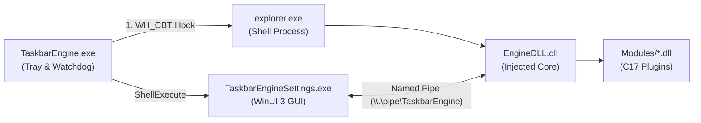

# TaskbarEngine

[-0078D4?logo=windows)](https://www.microsoft.com/windows)
[](CMakeLists.txt)
[](build.md)
[](LICENSE)

**TaskbarEngine** is a lightweight, hardware-accelerated systems utility designed to customize and enhance the Windows 11 taskbar. By executing directly within the `explorer.exe` process space via targeted `WH_CBT` hook injection and utilizing DirectComposition hardware overlays, TaskbarEngine delivers fluid visual modifications and geometry control with zero perceptible latency and negligible system impact.

---

## Technical Highlights

- **Hardware-Accelerated Visuals:** DirectComposition overlays synchronized with DWM commit cycles, enabling fluid $60\text{--}144\text{ FPS}$ animations without reparenting native XAML UI elements.
- **Near-Zero System Footprint:** Uses $0\%$ CPU at idle, $<0.5\%$ average CPU during active physics transitions, and $<10\text{ MB}$ working set memory.
- **Pure C17 Plugin ABI:** A strictly versioned, frozen function-pointer interface ([`te_plugin.h`](file:///d:/CODE/Utlities/Taskbar/SDK/include/sdk/te_plugin.h)) eliminating C++ name mangling, runtime mismatch hazards, and fragile base class issues.
- **Fault-Isolated Runtime:** Plugin boundary crossings are guarded by Win32 Structured Exception Handling (`__try` / `__except`). Rogue plugins are automatically quarantined, preventing Explorer crashes.
- **Zero-Restart Live Reloading:** Non-blocking directory watchers (`ReadDirectoryChangesW`) and Named Pipe IPC allow real-time parameter tuning without restarting Windows Explorer.
- **Resilient Crash Recovery:** Automatic hook re-establishment and state synchronization across shell restarts, display topology changes, and DPI adjustments.

---

## Deep-Dive Documentation

For comprehensive engineering specifications, architecture diagrams, and compilation workflows, refer to the dedicated documentation:

- 🏛️ **[System Architecture & Internals (`architect.md`)](architect.md)**  
  Detailed coverage of the two-process runtime model, targeted injection pipeline, phase-split loader lock avoidance, DirectComposition rendering pipeline, IPC binary protocol, and exception containment.

- 🛠️ **[Build & Customization Guide (`build.md`)](build.md)**  
  Complete toolchain prerequisites, MSVC and Clang-cl CMake presets, automated packaging, step-by-step configuration tuning, and a complete tutorial on writing custom C17 plugins.

---

## How It Works

TaskbarEngine operates via a multi-process cooperative architecture designed for performance and stability:



1. **Targeted Injection:** `TaskbarEngine.exe` resolves the thread ID of `Shell_TrayWnd` and installs a localized `WH_CBT` hook. The hook is uninstalled immediately once `EngineDLL.dll` attaches, eliminating system-wide hooking overhead.
2. **Subclassing & Lifecycle Management:** The core subclasses `Shell_TrayWnd` via `SetWindowSubclass` to intercept shell notifications and frame events directly on the Explorer GUI message pump.
3. **Hardware Rendering:** Visual effects are applied via DirectComposition visual transform trees composed over taskbar elements, guaranteeing jitter-free hardware compositing.
4. **Out-of-Process Management:** The tray host monitors Explorer process health via `RegisterWaitForSingleObject`, automatically reinjecting and restoring state if Explorer restarts.

---

## Shipped Plugins

| Plugin | Dynamic Library | Description | Key Capabilities |
|---|---|---|---|
| **Taskbar Resize** | `taskbar_resize.dll` | Adjusts taskbar height, padding, work area offsets, and icon density. | Height customization ($24\text{--}72\text{px}$), `SPI_SETWORKAREA` broadcast, custom icon margins. |
| **Icon Hover** | `icon_hover.dll` | macOS Dock-style magnification wave and physics over taskbar icons. | Dynamic magnification ($1.0\text{--}2.5\times$), gaussian/cubic falloff curves, spring rebound, perspective tilt, custom start button graphic. |
| **Dock Physics** | `DockPhysics.dll` | Spring-damper physical interaction engine for icon translation. | Spring stiffness tuning, damping ratio, velocity-based overshoot. |

---

## Quick Start

### 1. Installation

1. Download the latest release package (`TaskbarEngine-v1.0.0.zip`) from the [Releases](https://github.com/Naseer-fez/Taskbarengine/releases) section.
2. Extract the archive to your preferred directory (e.g. `C:\Tools\TaskbarEngine`).
3. Run `TaskbarEngine.exe`.
   - The application starts in your system notification tray.
   - Administrative elevation is **not** required.

### 2. Adjusting Settings

You can customize TaskbarEngine via the graphical interface or directly through configuration files:

- **Graphical Interface:** Double-click the system tray icon or right-click and select **Settings** to launch the dynamic WinUI 3 interface.
- **Direct Configuration:** Edit `%LOCALAPPDATA%\TaskbarEngine\config.jsonc`. Any saved changes take effect immediately without restarting Explorer:

```jsonc
{
  "core": {
    "log_level": "info",
    "log_max_files": 5
  },
  "plugins": {
    "taskbar_resize": {
      "enabled": true,
      "height": 48,
      "padding_top": 4,
      "padding_bottom": 4,
      "icon_spacing": 16
    },
    "icon_hover": {
      "enabled": true,
      "max_scale": 1.75,
      "radius": 160,
      "curve": "gaussian",
      "speed_ms": 180,
      "bounce_enabled": true,
      "tilt_enabled": true
    }
  }
}
```

---

## Building from Source

### Prerequisites

- **OS:** Windows 11 (Version 22H2 or higher, Build 22621+)
- **Compiler:** MSVC 2022 (v17.4+) or Clang-cl (LLVM 16.0+)
- **Build Tools:** CMake 3.25+ and Ninja
- **Windows SDK:** 10.0.22621.0 or newer

### Build Commands

```powershell
# 1. Clone repository
git clone https://github.com/Naseer-fez/Taskbarengine.git
cd Taskbarengine

# 2. Configure release build with CMake preset
cmake --preset msvc-release

# 3. Compile all binaries
cmake --build --preset msvc-release

# 4. Execute unit test suite
ctest --test-dir build/msvc-release --output-on-failure
```

For full build configurations, ASan debugging, and packaging steps, see **[build.md](build.md)**.

---

## Clean Uninstallation

To completely remove TaskbarEngine:

1. Right-click the system tray icon and select **Exit**, or execute:
   ```powershell
   TaskbarEngine.exe --uninstall
   ```
2. Delete the application directory and the configuration folder at `%LOCALAPPDATA%\TaskbarEngine`.

All taskbar visual adjustments and work areas automatically revert to native Windows defaults.

---

## Repository Structure

```
Taskbarengine/
├── App/                 # Tray host application, watchdog, and logon scheduler
├── Core/                # In-process engine core (subclass proc, plugin manager, IPC)
├── Modules/             # Shipped plugin implementations (resize, hover, dock)
├── SDK/                 # C17 plugin headers, JSONC parser, logging ring buffer
├── Tests/               # Catch2 automated test suite
├── Benchmarks/          # Google Benchmark performance validation suite
├── Config/              # Default configuration templates and assets
├── Docs/                # Comprehensive technical specification documents
├── architect.md         # Architecture, internals, and IPC specifications
├── build.md             # Compilation, customization, and plugin creation guide
└── CMakeLists.txt       # Root build configuration
```

---

## License

TaskbarEngine is distributed under the terms of the [MIT License](LICENSE).

