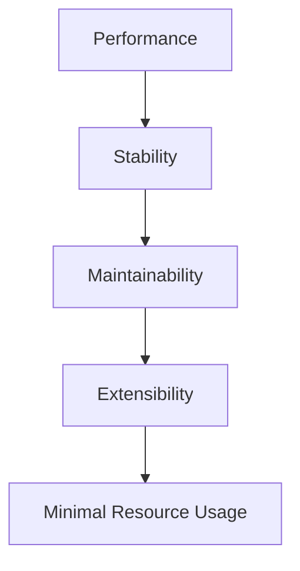
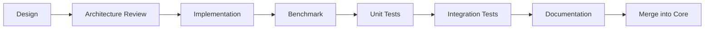

# 00 — Project Overview

> **TaskbarEngine** — An Ultra-Lightweight, Highly Customizable Windows 11 Taskbar Customization Engine.

---

## Purpose

This document provides the top-level vision, scope, design philosophy, and constraints for the TaskbarEngine project. It is the entry point to the complete software design documentation set and is intended for senior Windows systems engineers responsible for implementation.

TaskbarEngine is a modular, plugin-driven platform that allows end users to customize nearly every visual and behavioral aspect of the Windows 11 taskbar while consuming near-zero system resources when idle. The system is engineered to feel like a native Windows component rather than a third-party overlay.

---

## Scope

### In Scope

| Area | Description |
|---|---|
| Taskbar geometry | Dynamic height, padding, margins, icon spacing, DPI awareness, multi-monitor. |
| Icon behavior | macOS-style hover scaling, neighbor influence, configurable animation curves. |
| Visual effects | Blur, acrylic, mica, rounded corners, floating taskbar, transparency. |
| Shell integration | Start menu, notification area, widgets, virtual desktop enhancements. |
| Plugin platform | Independent modules compiled separately, communicating only through the Core API. |
| Configuration | TOML-based, hot-reloadable, validated, with version migration. |
| GUI | WinUI 3 application that edits configuration and sends commands; never directly touches Windows. |
| Performance | 0% idle CPU, <10 MB idle RAM, <50 ms startup, 60–120 FPS animations. |

### Out of Scope (v1)

- Replacement of the Explorer process or the taskbar window itself.
- Custom shell replacements (StartAllBack / ExplorerPatcher-style full takeover).
- Theme packager / marketplace / online distribution.
- Non-Windows platforms.
- Direct patching of `explorer.exe` in memory (binary patching is explicitly forbidden; see [Security Considerations](#security-considerations)).

---

## Responsibilities

TaskbarEngine, as a whole system, is responsible for:

1. **Customization** — Applying user-requested visual and behavioral changes to the Windows 11 taskbar.
2. **Stability** — Never crashing, hanging, or destabilizing `explorer.exe` under any circumstance.
3. **Performance** — Meeting strict idle, average, and peak resource budgets defined in [Performance Targets](#performance-targets).
4. **Modularity** — Loading, unloading, and routing events to independent feature plugins without coupling them.
5. **Extensibility** — Allowing new features to be added as plugins without modifying the Core Manager.
6. **Configurability** — Parsing, validating, hot-reloading, and migrating TOML configuration.
7. **Observability** — Providing asynchronous, level-filtered logging for diagnostics.

The project is **not** responsible for:

- Reimplementing the Windows shell.
- Replacing desktop window management (DWM) logic.
- Persisting state to the registry or cloud.

---

## Design Goals

The project is governed by five non-negotiable goals, ranked in priority order. When goals conflict, the higher-ranked goal wins.



| Priority | Goal | Rationale |
|---|---|---|
| 1 | **Performance** | The taskbar is always-on; even 1% idle CPU is unacceptable across millions of machines. |
| 2 | **Stability** | A crash in Explorer disrupts the entire user session; resilience is mandatory. |
| 3 | **Maintainability** | Clear layering and small focused functions reduce regression risk over time. |
| 4 | **Extensibility** | The plugin ABI must allow new features without touching Core source. |
| 5 | **Minimal Resource Usage** | Binary footprint, heap allocations, and thread count must stay minimal. |

### Core Philosophy

- **Event-driven.** The system wakes only when Windows generates an event. No polling. No busy-waiting. No background timers unless a feature explicitly requires one and justifies it.
- **Native feel.** Behavior, timing, and visual fidelity should match or exceed the default taskbar. Third-party "overlay" aesthetics are avoided.
- **Composition over inheritance.** Plugins compose SDK utilities; deep inheritance hierarchies are forbidden.
- **No global mutable state.** Shared state lives in the Core Manager and is accessed via accessors; plugins own their private state.

---

## Technology Decisions

The following decisions are locked for v1 and will be reflected consistently across all documents in this set.

| Concern | Decision | Rationale |
|---|---|---|
| Build system | **CMake + Ninja**, MSVC toolchain | Best Windows/MSVC support, minimal abstraction, fast incremental builds, native Visual Studio integration. |
| Plugin ABI | **C++ COM-style interfaces** (`IUnknown`-derived) | Idiomatic Windows shell integration, stable ABI, marshaling support, RAII-friendly. |
| GUI | **WinUI 3 / Windows App SDK** | Native Win11 look, dynamic settings pages generated from plugin metadata, clean separation from engine. |
| IPC | **In-process DLLs (host) + named pipe to GUI** | Simplest, safest model for Explorer stability; GUI is a separate process that only sends commands. |
| Configuration | **Custom minimal TOML parser in the SDK** | Zero external deps, exact control over hot-reload and validation, honors "no third-party duplication" rule. |
| Language default | **C** | Preferred for memory, threading, utilities, Win32 wrappers, file I/O, plugin loader. |
| C++ usage | **Only where C is insufficient** | COM, RAII, DirectComposition, DirectX, templates, smart pointers, advanced lifetime. |
| Rust usage | **Gated per-plugin** | Allowed only when benchmarks show >5% improvement in CPU, memory, startup, binary size, or significant safety benefit. |

### Windows API Priority

Implementations must prefer official APIs in this order:

1. Win32 API
2. COM
3. Windows App SDK
4. DirectComposition
5. DWM (`DWMAPI`)
6. DirectX 11/12

Undocumented APIs are permitted **only** when no supported alternative exists. When used, they must be:
- Clearly documented (why no supported alternative exists).
- Isolated behind a wrapper in the SDK.
- Gracefully degraded if they fail at runtime.

> **Forbidden:** Binary patching of `explorer.exe` in memory. The project never writes to Explorer's code sections.

---

## Performance Targets

These targets are hard requirements, not aspirations. Every feature must be benchmarked against them (see `13_Benchmarking.md`).

| Metric | Target | Measurement Context |
|---|---|---|
| Idle CPU | **0%** | No user interaction, no animation, plugins loaded. |
| Average CPU | **< 0.5%** | Typical interaction over 60s window. |
| Peak CPU | **< 2%** | During animation burst or config hot-reload. |
| Idle RAM | **< 10 MB** | Resident set of host process, all plugins loaded, idle. |
| Plugin load | **< 5 ms** | `LoadLibrary` + `Initialize` + `Enable` per plugin. |
| Startup | **< 50 ms** | Cold start to all plugins enabled. |
| Animation latency | **< 2 ms** | Input event to first composited frame. |
| Taskbar redraw | **< 1 ms** | Invalidate to present. |
| Frame rate | **≥ 60 FPS**, target **120 FPS** where supported | During active animation. |
| GPU usage | Negligible except during animations | Measured via GPU View / PresentMon. |

---

## Memory & Threading Rules

### Memory

- **No heap allocations during rendering.** Pre-allocate buffers at plugin enable time; reuse across frames.
- **Prefer stack allocation** for transient, small, scoped data.
- **Zero leaks.** Verified with AddressSanitizer (ASan) and leak detectors in CI.
- **Avoid fragmentation.** Long-lived allocations are pooled; per-frame allocations are forbidden.

### Threading

- **Minimize thread count.** The host process should own at most: 1 message-pump thread, 1 composition thread, 1 async-log thread, and a bounded thread pool used only when justified.
- **Prefer asynchronous event callbacks** over worker threads.
- **No polling loops.** A feature requiring a timer must register a single high-resolution `CreateTimerQueueTimer` or waitable timer and document why.
- **Thread pools** are permitted only for bursty, short-lived work (e.g., parallel config validation) and must be bounded.

---

## Logging & Error Handling

### Logging

| Level | Use |
|---|---|
| Debug | Verbose traces; compiled out in Release by default. |
| Info | Lifecycle events (plugin load/unload, config reload). |
| Warning | Recoverable degradations (e.g., undocumented API unavailable). |
| Error | Failures that disable a feature but do not crash the host. |

- Logging is **asynchronous** — a dedicated ring buffer drained by a background thread.
- Disabled in Release by default; enabled via config flag for support scenarios.

### Error Handling

Every failure must:
- Return a meaningful `HRESULT` or typed error code.
- Avoid crashes — no uncaught exceptions cross the plugin ABI boundary.
- Recover gracefully — disable the offending plugin, keep the host alive.
- **Never terminate Explorer.**

---

## Initial Features

The v1 release delivers two features, each as an independent plugin:

### Feature 1 — Dynamic Taskbar Resize

| Capability | Detail |
|---|---|
| Height adjustment | Arbitrary height within validated bounds. |
| Padding / margins | Per-side configurable. |
| Icon spacing | Configurable gap with min/max clamping. |
| DPI awareness | Per-monitor DPI v2 aware. |
| Multi-monitor | Per-monitor geometry independence. |

### Feature 2 — macOS-style Icon Hover Animation

| Capability | Detail |
|---|---|
| Smooth scaling | Configurable scale factor (e.g., `1.30`). |
| Neighbor influence | Configurable radius and falloff curve. |
| Animation curve | Configurable easing (linear, ease, cubic, custom). |
| Speed | Configurable duration in ms. |
| Frame rate | 60–120 FPS, GPU-accelerated via DirectComposition. |

See `10_Taskbar_Resize.md` and `11_Icon_Hover.md` for full design.

---

## Future Features

The platform is designed to accommodate the following without Core changes. Each will be a plugin:

- Blur · Acrylic · Mica · Rounded corners · Floating taskbar
- Auto-hide improvements · Workspace profiles · Per-monitor customization
- Custom system tray · Custom widgets · Weather · Clock improvements
- Battery statistics · Volume widget · Music controls · Workspace switcher
- Window previews · Virtual desktop enhancements · Custom animations · Theme engine

See `18_Future_Features.md` for the roadmap and plugin sketches.

---

## Development Workflow

Development is strictly serial per feature. No two unfinished features may be worked on simultaneously.



Each feature must pass all gates before merge. See `14_Testing.md` and `13_Benchmarking.md`.

---

## Deliverables Per Feature

| Deliverable | Location |
|---|---|
| Source code | `Modules/<Feature>/` |
| Documentation | `Docs/` + per-module `README.md` |
| Architecture explanation | Feature's design doc (e.g., `10_Taskbar_Resize.md`) |
| Benchmarks | `Benchmarks/<Feature>/` |
| Unit tests | `Tests/<Feature>/` |
| Integration tests | `Tests/Integration/` |
| Configuration examples | `Config/examples/` |
| API documentation | Generated from headers (Doxygen) |
| Performance analysis | `Benchmarks/<Feature>/report.md` |
| Future improvement suggestions | Feature's design doc, final section |

---

## Project Structure (Top-Level)

```
TaskbarEngine/
├── Core/        # Core Manager: lifecycle, event routing, config bridge
├── GUI/         # WinUI 3 app: config editing, command dispatch
├── SDK/         # Shared SDK: utilities, Win32 wrappers, plugin API
├── Modules/     # Independent plugins (one folder per feature)
├── Resources/   # Icons, default config, manifests
├── Config/      # TOML configs and examples
├── Tests/       # Unit + integration tests
├── Benchmarks/  # Per-feature and system benchmarks
├── Docs/        # This documentation set
├── Scripts/     # Build, packaging, CI helpers
└── ThirdParty/  # Vendored dependencies (if any)
```

Full layout is defined in `02_Project_Structure.md`.

---

## Security Considerations

| Risk | Mitigation |
|---|---|
| **Explorer crash** | Plugins run in a host process with fault isolation; failures disable the plugin, never the host. |
| **Memory patching** | Forbidden. The project never writes to `explorer.exe` code sections. |
| **Undocumented APIs** | Isolated behind SDK wrappers; runtime-checked; gracefully degraded. |
| **Plugin supply chain** | Plugins are signed; the Core Manager verifies a signature blob before `LoadLibrary`. |
| **Config injection** | TOML parser is sandboxed; no `include` of external paths; values validated against schemas. |
| **IPC privilege** | Named pipe is restricted to the invoking user's SID; no `Everyone` ACL. |
| **Logging leakage** | Logs never contain window titles, file paths, or PII by default; opt-in fields only. |

---

## Future Improvements

- **Per-user plugin store** with signature verification and rollback.
- **Hot plugin swap** without host restart (currently requires disable→unload→load cycle).
- **Rust SDK bindings** for plugins that meet the >5% benchmark gate.
- **GPU performance counters** integrated into the benchmark harness.
- **Telemetry-opt-in** for aggregate feature-usage statistics (privacy-preserving).

---

## References

- Windows App SDK — https://learn.microsoft.com/en-us/windows/apps/windows-app-sdk/
- DirectComposition — https://learn.microsoft.com/en-us/windows/win32/directcomp/directcomposition-portal
- DWM — https://learn.microsoft.com/en-us/windows/win32/dwm/dwm-overview
- COM — https://learn.microsoft.com/en-us/cpp/windows/atl/com-introduction
- TOML spec (v1.0.0) — https://toml.io/en/v1.0.0

---

## Related Documents

Previous:
- _(none — this is the entry point)_

Next:
- [01_System_Architecture.md](./01_System_Architecture.md)

---

## Documentation Progress

Completed:
- [x] 00_Project_Overview.md

Remaining:
- [ ] 01_System_Architecture.md
- [ ] 02_Project_Structure.md
- [ ] 03_Core_Manager.md
- [ ] 04_Plugin_System.md
- [ ] 05_Shared_SDK.md
- [ ] 06_GUI.md
- [ ] 07_Configuration.md
- [ ] 08_Event_System.md
- [ ] 09_Rendering.md
- [ ] 10_Taskbar_Resize.md
- [ ] 11_Icon_Hover.md
- [ ] 12_Performance.md
- [ ] 13_Benchmarking.md
- [ ] 14_Testing.md
- [ ] 15_API_Reference.md
- [ ] 16_Build_System.md
- [ ] 17_Deployment.md
- [ ] 18_Future_Features.md
- [ ] 19_Appendix.md
