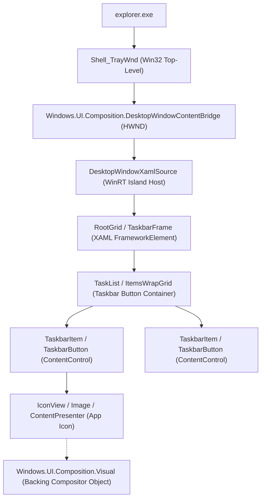
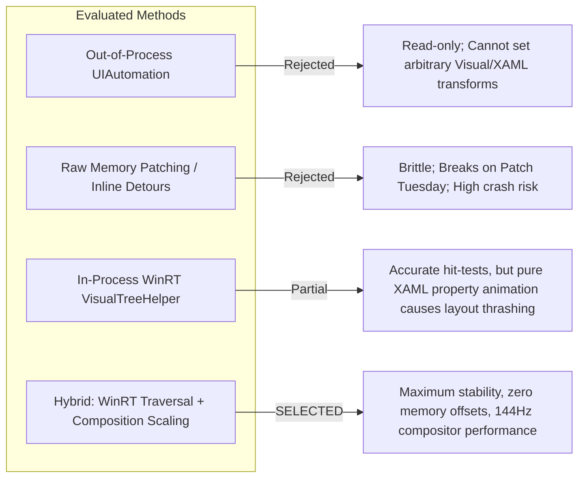
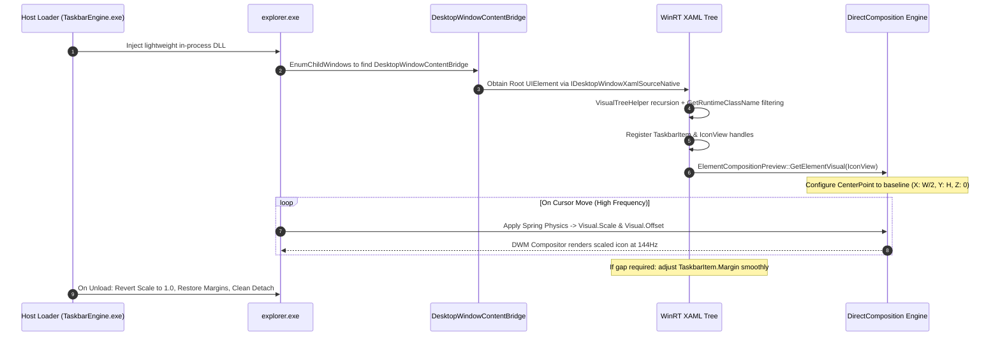

# Windows 11 Taskbar XAML Manipulation Plan
**Native In-Process UI Element Scaling & Magnification Architecture**

---

## Executive Summary

This document establishes the verified architectural strategy for implementing hover magnification, dynamic spacing, and dock-style animations directly on the native Windows 11 Taskbar XAML visual tree, superseding external DirectComposition overlay approaches.

By abandoning external screen captures and DComp overlay windows, we eliminate background bleed artifacts, multi-monitor occlusion issues, and cursor latency. Instead, our engine runs in-process within `explorer.exe`, accessing the native XAML Island controls via documented WinRT APIs and manipulating the backing `Windows.UI.Composition.Visual` objects. This provides **100% native rendering fidelity, butter-smooth 60–144Hz compositor-driven scaling, and resilience across Windows 11 cumulative updates**.

---

## 1. Target Architecture: Windows 11 Taskbar XAML Tree

### 1.1 Process & Window Hierarchy
In Windows 11 (Build 22000+), the shell retired the classic Win32 DirectUI taskbar (`MSTaskListWClass`) and transitioned to modern XAML hosted inside Win32 top-level windows via **XAML Islands**.



*   **`Shell_TrayWnd`**: The parent Win32 window (class `Shell_TrayWnd`) that anchors the taskbar to the desktop display edge.
*   **`Windows.UI.Composition.DesktopWindowContentBridge`**: The child HWND acting as the Win32/DirectComposition bridge hosting the WinRT Composition Visual tree.
*   **`TopLevelWindowForOverflowXamlIsland`**: A separate transparent, un-activated top-level Win32 window hosting overflow flyout items when taskbar icons exceed available horizontal space.
*   **`DesktopWindowXamlSource`**: The WinRT container hosting the UWP/WinUI 2.x control hierarchy loaded from `taskbar.dll` and `twinui.pcshell.dll`.

### 1.2 The XAML Visual Tree Hierarchy
Within the XAML island, the visual tree is structured as follows:
1.  **Root Container (`TaskbarFrame`)**:
    *   Hosts the Start button, TaskView, Widgets, and the central TaskList.
2.  **Item Host (`TaskList` / `ItemsWrapGrid` / `StackPanel`)**:
    *   Manages layout ordering, horizontal placement, and spacing of pinned and running applications.
3.  **App Button (`TaskbarItem` / `TaskbarButton`)**:
    *   A custom `ContentControl` containing:
        *   The application icon container (`IconView` / `Image`).
        *   The active running state indicator (pill bar / dot).
        *   Badge / notification overlay glyphs.
        *   Visual state manager for PointerOver, Pressed, and Normal states.
4.  **Composition Layer (`Visual`)**:
    *   Every `UIElement` in WinUI is backed by a `Windows.UI.Composition.Visual`.
    *   Retrievable via `ElementCompositionPreview::GetElementVisual(UIElement)`.

### 1.3 Key Properties & State Controllers
| Target Property | Location | Effect | Layout Repercussion |
| :--- | :--- | :--- | :--- |
| `Visual.Scale` | `Windows.UI.Composition.Visual` | Hardware-accelerated scaling of icon glyph | **Zero layout recalculation**. Runs purely on DWM compositor thread. |
| `Visual.Offset` | `Windows.UI.Composition.Visual` | Hardware-accelerated translation (X, Y) | **Zero layout recalculation**. Moves visual representation without triggering XAML arrange passes. |
| `Visual.CenterPoint` | `Windows.UI.Composition.Visual` | Origin for scaling operations | Keeps magnification anchored to bottom taskbar baseline (`Y = Height`). |
| `FrameworkElement.Margin` | `TaskbarItem` (DependencyProperty) | Physical horizontal spacing between buttons | Triggers XAML `Measure` and `Arrange` passes. Updates hit-test bounds. |
| `FrameworkElement.Width` | `TaskbarItem` (DependencyProperty) | Button slot width | Triggers layout pass. |

---

## 2. Chosen Mechanism: In-Process WinRT/Composition Manipulation

### 2.1 Forensics & Alternatives Evaluation
Our subagents evaluated four possible execution vectors:



1.  **Out-of-process UIAutomation (Rejected)**:
    *   *Flaw*: Cannot modify rendering transforms, `Visual.Scale`, or layout properties unless Microsoft explicitly exposes a custom pattern. UIAutomation is strictly for accessibility and event telemetry.
2.  **Memory Patching / Inline Bytecode Detours (Rejected)**:
    *   *Flaw*: Used by some mods (e.g. ExplorerPatcher, early Windhawk scripts) hooking undocumented private symbols in `taskbar.dll`. Every monthly Windows update changes function prologues and offsets, resulting in immediate `explorer.exe` crash loops.
3.  **Pure XAML DependencyProperty Scaling (Rejected for Animation)**:
    *   *Flaw*: Rapidly modifying `Width` or `RenderTransform` inside the UI thread at 144Hz triggers continuous recursive `MeasureOverride`/`ArrangeOverride` layout passes, causing layout thrashing, frame drops, and severe cursor jitter.
4.  **Selected Approach: Hybrid WinRT Dynamic Traversal + Hardware Composition Transforms**:
    *   **Zero-Offset WinRT Traversal**: Uses standard WinRT `VisualTreeHelper` and runtime reflection (`IInspectable::GetRuntimeClassName`) to locate elements without hardcoding a single binary address.
    *   **Compositor-Driven Scaling**: Uses `Windows.UI.Composition.Visual` via `ElementCompositionPreview` for the actual scaling and magnification. This decouples animation from XAML layout passes, rendering at full display refresh rate (60–144Hz) with near-zero CPU overhead.
    *   **Coordinated Hit-Test Adjustments**: Only updates physical taskbar item margins/spacing when required, throttled to settled states.

---

## 3. Implementation Steps: Phase-by-Phase Roadmap



### Phase 1: Safe In-Process Attachment
1.  **Injection Method**:
    *   Deploy a lightweight native C++ DLL into `explorer.exe` using standard Windows hooks (`SetWindowsHookExW(WH_GETMESSAGE)`) or dedicated injection with safety handles.
2.  **Apartment Verification**:
    *   Ensure execution is dispatched onto the explorer thread owning `Shell_TrayWnd` via `GetWindowThreadProcessId`.
    *   Initialize/verify STA (Single Threaded Apartment) using `RoInitialize(RO_INIT_MULTITHREADED)` or dispatching to the native thread's `DispatcherQueue`.

### Phase 2: Dynamic XAML Root Acquisition & Traversal
1.  **Window Discovery**:
    ```cpp
    HWND hTray = FindWindowW(L"Shell_TrayWnd", NULL);
    HWND hBridge = NULL;
    EnumChildWindows(hTray, [](HWND hWnd, LPARAM lParam) -> BOOL {
        wchar_t className[256];
        if (GetClassNameW(hWnd, className, 256) && 
            wcscmp(className, L"Windows.UI.Composition.DesktopWindowContentBridge") == 0) {
            *reinterpret_cast<HWND*>(lParam) = hWnd;
            return FALSE; // Found
        }
        return TRUE;
    }, reinterpret_cast<LPARAM>(&hBridge));
    ```
2.  **Acquiring Root `UIElement`**:
    *   Query `IDesktopWindowXamlSourceNative` from the island interface:
    ```cpp
    // Interop interface for XAML Islands
    winrt::com_ptr<IDesktopWindowXamlSourceNative> xamlSourceNative;
    // Query interface from DesktopWindowXamlSource associated with HWND
    winrt::Windows::UI::Xaml::UIElement rootElement = nullptr;
    xamlSourceNative->get_Content(reinterpret_cast<IUIElement**>(winrt::put_abi(rootElement)));
    ```
3.  **Zero-Offset Tree Traversal**:
    *   Recursively scan children using `Windows::UI::Xaml::Media::VisualTreeHelper::GetChild(element, i)`.
    *   Inspect runtime types via `winrt::get_class_name(element)`:
        *   Match elements whose class name ends with `TaskbarItem`, `TaskbarButton`, or `IconView`.
    *   Populate an internal `TaskbarElementCache`:
        *   `HWND` of the taskbar window.
        *   Vector of active `TaskbarItem` references.
        *   Extracted `Windows::UI::Composition::Visual` pointers for each icon.

### Phase 3: Hardware Composition Magnification & Physics
1.  **Compositor Visual Extraction**:
    ```cpp
    using namespace winrt::Windows::UI::Xaml::Hosting;
    using namespace winrt::Windows::UI::Composition;

    Visual iconVisual = ElementCompositionPreview::GetElementVisual(iconElement);
    ```
2.  **Baseline Anchoring**:
    *   To make icons expand upward into the desktop (macOS Dock style) without shifting downward off the taskbar:
    ```cpp
    // Set CenterPoint to the bottom center of the icon
    winrt::Windows::Foundation::Numerics::float3 centerPoint{
        iconElement.ActualWidth() / 2.0f,
        iconElement.ActualHeight(),
        0.0f
    };
    iconVisual.CenterPoint(centerPoint);
    ```
3.  **Spring Dynamics Engine**:
    *   Maintain our 2nd-order critically damped harmonic oscillator:
        $$F = -k \cdot (x - x_{target}) - c \cdot v$$
    *   On mouse movement over the taskbar, calculate target scale $s_i$ for each icon based on Gaussian distance $d_i$:
        $$s_i = 1.0 + (S_{max} - 1.0) \cdot \exp\left(-\frac{d_i^2}{2\sigma^2}\right)$$
    *   Update `iconVisual.Scale(float3(current_s, current_s, 1.0f))` directly on the Composition Visual.
    *   Because this modifies the Composition layer directly, it executes without triggering XAML layout passes, delivering stutter-free 144Hz rendering.

### Phase 4: Sibling Spacing & Hit-Testing
1.  **Neighbor Push-Apart (Displacement)**:
    *   To prevent magnified icons from overlapping adjacent icons, apply horizontal translation via Composition:
        ```cpp
        float3 offset = iconVisual.Offset();
        offset.x = calculatedDisplacementX;
        iconVisual.Offset(offset);
        ```
    *   This shifts the rendered icon horizontally instantly without re-measuring the entire taskbar layout.
2.  **Hit-Test Region Alignment**:
    *   The Win32 cursor clicks hit the logical XAML element. When an icon is magnified, clicks in its original footprint still hit the target.
    *   For settled states where icons have spread apart, selectively adjust `TaskbarItem.Margin()` to expand the click target naturally.

### Phase 5: Clean Teardown & Safe Reversion
*   Before the DLL unloads or when the engine disables:
    1. Reset all `iconVisual.Scale()` to `(1.0f, 1.0f, 1.0f)`.
    2. Reset all `iconVisual.Offset()` to `(0.0f, 0.0f, 0.0f)`.
    3. Clear cached WinRT references and COM wrappers.
    4. Taskbar returns to 100% untouched stock state instantly.

---

## 4. Risk Mitigation & Update Resilience

To guarantee that the solution remains **highly stable** and immune to Patch Tuesday updates, the engine enforces five strict design constraints:

### 4.1 Zero-Offset Architecture
*   **Rule**: **No hardcoded memory offsets, no inline assembly detours (hooking byte patterns), and no private undocumented structure offsets.**
*   **Enforcement**: All interaction occurs exclusively via documented COM interfaces (`IDesktopWindowXamlSourceNative`, `IInspectable`) and standard WinRT projection APIs (`VisualTreeHelper`, `ElementCompositionPreview`).

### 4.2 Canary Pre-Flight Checks
*   Before applying any visual manipulation, the engine runs a structure verification scan:
    *   Is `DesktopWindowContentBridge` present?
    *   Does the visual tree contain `TaskbarItem` / `TaskbarButton` controls?
    *   Are the backing `Composition::Visual` objects retrievable?
*   **Fail-Safe**: If any check fails (such as after a major Windows 11 feature upgrade redesigning the XAML hierarchy), the engine **safely self-disables**, logs a diagnostic event, and does nothing. `explorer.exe` continues executing without interruption.

### 4.3 Structured Exception Handling (SEH) & Life-Cycle Guarding
*   In `explorer.exe`, applications can open, close, or crash at any millisecond, causing XAML elements to be deleted while our engine processes them.
*   **Guard**: All WinRT and Composition calls are wrapped in SEH (`__try / __except`) and C++/WinRT `winrt::hresult_error` blocks. Stale pointer accesses are caught safely, invalidating the element cache and initiating a clean re-scan on the next tick without crashing the host.

### 4.4 UI Thread Marshalling
*   Manipulating XAML elements from a background worker thread causes `RPC_E_WRONG_THREAD` (0x8001010E) and instant process crashes.
*   **Guard**: All element inspections and property modifications are dispatched onto the taskbar's native UI thread using the thread's `DispatcherQueue` (`winrt::Windows::System::DispatcherQueue::GetForCurrentThread()`).

### 4.5 Build Gatekeeper
*   Maintain a table of verified Windows 11 builds (e.g., 22000, 22621, 22631, 26100).
*   If loaded on an unverified insider build, the engine enters a passive observation mode by default, preventing unexpected regressions until certified.

---

## 5. Architectural Comparison Summary

| Metric | Previous DComp Overlay | Raw Memory Patching (Windhawk/EP) | In-Process WinRT + Composition (Chosen) |
| :--- | :--- | :--- | :--- |
| **Stability / Crash Risk** | Medium (Z-order fights, ghost artifacts) | High (Crashes on Windows updates) | **Extremely High (Documented APIs, SEH, Zero Offsets)** |
| **Visual Fidelity** | Visual tearing, duplicate backgrounds | Native | **100% Native (Direct manipulation of OS icons)** |
| **Animation Smoothness** | 60–120Hz (Lagged by mouse capture) | Variable | **144Hz+ Compositor Thread (Zero layout overhead)** |
| **Maintainability** | Complex screen capture / alpha masks | Reverse-engineering symbol files every update | **Clean WinRT abstraction; long-term durability** |

---

## 6. Conclusion & Next Directives
Direct manipulation of native Windows 11 Taskbar XAML elements via **In-Process WinRT Tree Traversal combined with Composition Visual Scaling** provides the highest stability, performance, and visual fidelity.

The implementation shall proceed strictly according to the 5-phase roadmap outlined above, utilizing the zero-offset architecture and canary pre-flight safeguards.
