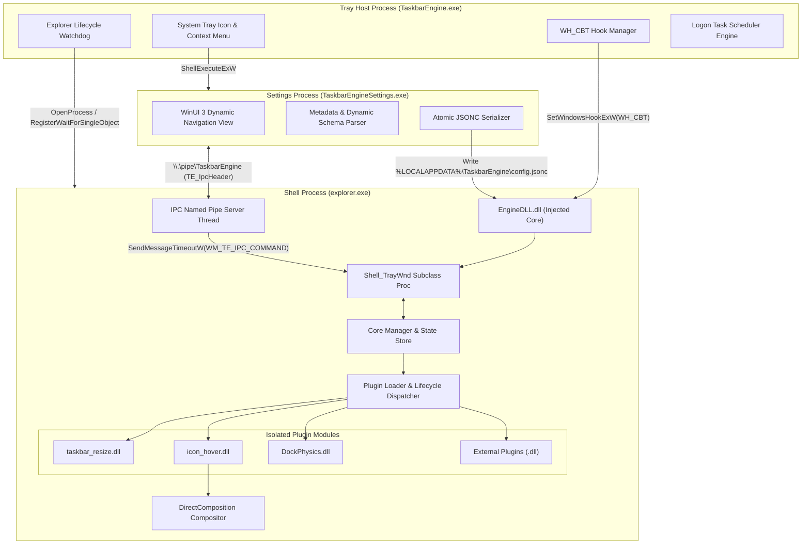
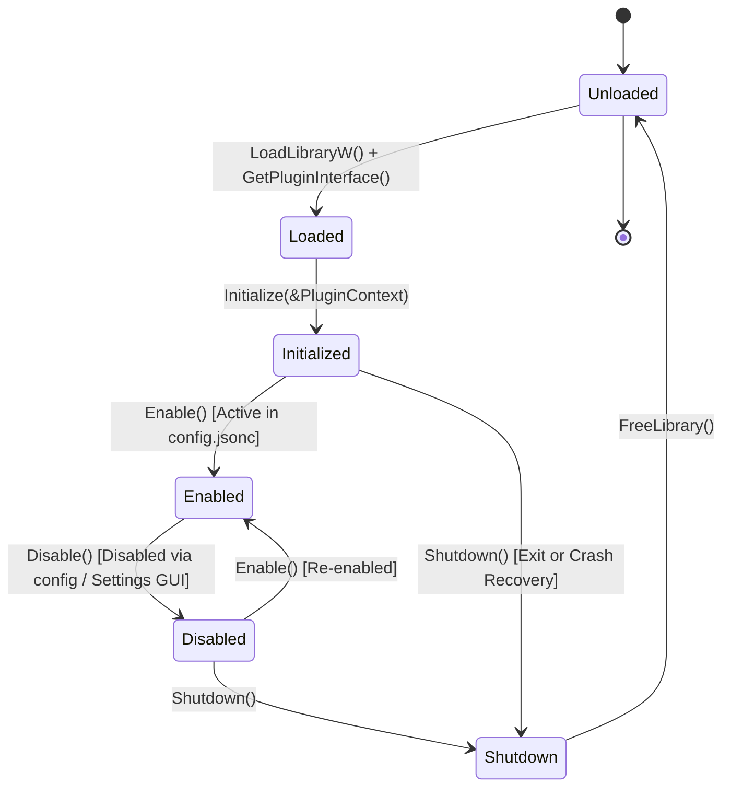
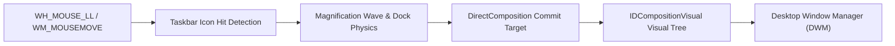

# TaskbarEngine Architecture & System Internals

## 1. Executive Summary & Design Tenets

TaskbarEngine is a low-overhead, hardware-accelerated Windows 11 taskbar enhancement framework. It operates directly inside the `explorer.exe` process space to eliminate IPC latency during user interaction, while isolating UI orchestration, crash containment, configuration, and telemetry into specialized boundaries.

The core architecture adheres to five primary design tenets:

1. **Native Frame-Time Synchronization:** Critical-path animations run via DirectComposition visual transform trees with sub-millisecond commit latency and hardware refresh rate synchronization ($60\text{--}144\text{ Hz}$).
2. **Strict C17 Binary Interface (ABI):** An immutable C function-pointer table (`PluginInterface`) and context structure (`PluginContext`) guarantees binary stability across different compilers and runtimes without C++ name-mangling or fragile base-class hazards.
3. **Structured Exception Containment:** Every boundary crossing into plugin code is protected by Win32 Structured Exception Handling (`__try` / `__except`). Internal faults increment fault counters, isolate failing hooks, and restore native shell geometry without crashing Windows Explorer.
4. **Zero Polling & Wait-Free Operations:** Inter-process and filesystem synchronization relies on Win32 I/O completion routines (`ReadDirectoryChangesW`, Overlapped Named Pipes, and subclass message pumps), maintaining $0\%$ CPU utilization at idle.
5. **Two-Phase Loader-Lock-Safe Injection:** Hook injection segregates module attachment from resource allocation to prevent OS loader-lock deadlocks during process initialization.

---

## 2. Multi-Process Architecture

TaskbarEngine distributes responsibilities across three dedicated processes:



### Process Separation Matrix

| Binary | Host Process | Role & Responsibilities |
|---|---|---|
| `TaskbarEngine.exe` | Standalone Win32 Process | System notification tray icon, targeted `WH_CBT` hook injection, Explorer lifetime watchdog, and Task Scheduler logon management. |
| `EngineDLL.dll` | Injected into `explorer.exe` | Core in-process engine. Subclasses `Shell_TrayWnd`, manages dynamic plugin loading, hosts the Named Pipe IPC server, watches config changes, and executes render commits. |
| `TaskbarEngineSettings.exe` | Standalone App Process | Windows App SDK / WinUI 3 interface. Dynamically renders settings controls by querying plugin schema descriptors via IPC, and writes modifications to disk atomically. |
| `te_sdk.lib` | Static SDK Library | Shared runtime contracts, ABI headers (`te_plugin.h`), JSONC comment preprocessor, lock-free ring-buffer logger, and math utilities. |

---

## 3. Targeted Injection Pipeline & Loader Lock Avoidance

Global Windows hooks (`WH_GETMESSAGE`, `WH_CALLWNDPROC`) broadcast hooks to all running GUI threads system-wide, introducing system latency. TaskbarEngine circumvents this by executing a **targeted thread-specific injection pipeline**:

```mermaid
sequenceDiagram
    autonumber
    participant Host as TaskbarEngine.exe
    participant Win32 as Windows Subsystem
    participant Explorer as explorer.exe (UI Thread)
    participant Dll as EngineDLL.dll

    Host->>Win32: FindWindowW(L"Shell_TrayWnd", NULL)
    Win32-->>Host: HWND taskbar_hwnd
    Host->>Win32: GetWindowThreadProcessId(taskbar_hwnd, &pid)
    Win32-->>Host: DWORD thread_id

    Host->>Win32: SetWindowsHookExW(WH_CBT, CBTProc, hEngineDll, thread_id)
    Win32-->>Host: HHOOK hHook
    Host->>Win32: PostMessageW(taskbar_hwnd, WM_NULL, 0, 0)
    Note over Explorer,Dll: Explorer processes WM_NULL;<br/>OS injects EngineDLL.dll into Explorer

    Explorer->>Dll: DllMain(DLL_PROCESS_ATTACH)
    Note over Dll: Phase A: Subclass Shell_TrayWnd,<br/>Post WM_TE_INIT, Return TRUE immediately
    Dll-->>Explorer: TRUE
    Host->>Win32: UnhookWindowsHookEx(hHook)

    Explorer->>Dll: SubclassProc receives WM_TE_INIT (Phase B)
    Note over Dll: Phase B: Load config.jsonc,<br/>Scan Modules/*.dll, Start IPC & Watchers
```

### Phase A vs. Phase B Initialization Contract

Windows executes `DllMain` holding the internal OS **Loader Lock**. Spawning threads, acquiring high-level locks, or invoking `LoadLibraryW` inside `DllMain` triggers deadlocks. TaskbarEngine enforces a two-phase initialization contract:

* **Phase A (`DllMain` / `TE_CoreManagerInitPhaseA`):**
  1. Inspects module path via `GetModuleFileNameW(NULL, ...)` to guarantee execution occurs strictly inside `explorer.exe`.
  2. Allocates internal singleton state structure (`TE_CoreState`).
  3. Installs window subclass on `Shell_TrayWnd` via `SetWindowSubclass` (`comctl32.dll`).
  4. Dispatches asynchronous notification `PostMessageW(taskbar_hwnd, WM_TE_INIT, 0, 0)`.
  5. Returns `TRUE` in $< 0.2\text{ ms}$.
* **Phase B (`TE_CoreManagerInitPhaseB`):**
  1. Executes on the primary Explorer UI message pump when `WM_TE_INIT` is processed.
  2. Reads and parses `%LOCALAPPDATA%\TaskbarEngine\config.jsonc`.
  3. Spawns the directory watcher thread via `ReadDirectoryChangesW`.
  4. Scans the `Modules/` directory and binds plugin DLLs.
  5. Launches the Named Pipe IPC listener thread.

---

## 4. Pure C17 Plugin ABI Specification

Defined in [`SDK/include/sdk/te_plugin.h`](file:///d:/CODE/Utlities/Taskbar/SDK/include/sdk/te_plugin.h), every plugin exports a single unmangled factory function:

```c
TE_EXPORT const PluginInterface* GetPluginInterface(void);
```

### The Interface Table (`PluginInterface`)

```c
typedef struct PluginInterface {
    HRESULT (*Initialize)(const PluginContext* ctx);
    HRESULT (*Enable)(void);
    HRESULT (*Disable)(void);
    HRESULT (*Update)(float deltaTime);
    HRESULT (*Shutdown)(void);
    const PluginMetadata* (*GetMetadata)(void);
    const PluginSettings* (*GetSettings)(void);
} PluginInterface;
```

### Lifecycle State Machine



### Contract Rules & Guardrails

1. **Execution Budgets:**
   - `Initialize()` must complete within **$< 5\text{ ms}$**. Heavy IO or DirectX setup must be asynchronous or deferred.
   - `Enable()` must complete within **$< 1\text{ ms}$**.
   - `Disable()` must cleanly revert all taskbar geometry modifications and unhook message callbacks within **$< 1\text{ ms}$**.
2. **Structured Exception Handling (SEH):**
   Every boundary call (`Initialize`, `Enable`, `Disable`, `Update`, window subclass routing) is evaluated through a structured exception filter:
   ```c
   __try {
       pInterface->Update(dt);
   } __except(TE_FaultFilter(GetExceptionInformation(), plugin_name)) {
       // Automatic isolation, emergency crash logging, and native geometry restoration
   }
   ```
   If a plugin encounters more than $3$ unhandled exceptions within $60$ seconds, the core permanently disables the module for the session.
3. **Inter-Plugin Blackboard & Event Bus:**
   Plugins decouple inter-dependencies through typed blackboard keys (`PublishState` / `QueryState`) and synchronous event subscriptions (`Subscribe` / `Unsubscribe`).

---

## 5. DirectComposition Rendering Pipeline

Visual plugins (`icon_hover`, `DockPhysics`) utilize DirectComposition hardware surfaces positioned over the taskbar window:



- **Visual Tree Virtualization:** Rather than reparenting native XAML UI elements (which can compromise internal XAML layout trees in `Windows.UI.Xaml.dll`), DirectComposition visual transform targets are composed on overlay visual roots linked to the taskbar compositor.
- **Hardware Interpolation:** Transform calculations execute using cubic, gaussian, or cosine curves calculated per frame and committed via `IDCompositionDevice::Commit()`.
- **Zero Allocation Render Loop:** Frame computations reuse static vertex and transform buffers, preventing heap churn on the render path.

---

## 6. IPC Protocol & Dynamic Settings Architecture

Communication between `EngineDLL.dll` inside Explorer and `TaskbarEngineSettings.exe` occurs over a dedicated Named Pipe: `\\.\pipe\TaskbarEngine`.

### Binary Frame Format

All packets sent over the pipe share a uniform 16-byte header:

```c
#pragma pack(push, 1)
typedef struct TE_IpcHeader {
    uint32_t magic;         /* TE_IPC_MAGIC (0x54454950 = "TEIP") */
    uint32_t message_type;  /* TE_IPC_MSG_* */
    uint32_t payload_size;  /* Payload length in bytes */
    uint32_t sequence_id;   /* Correlation ID */
} TE_IpcHeader;
#pragma pack(pop)
```

### Supported Message Commands

| Constant | Value | Direction | Description |
|---|---|---|---|
| `TE_IPC_MSG_PING` | `0x0001` | GUI $\rightarrow$ Engine | Verifies engine connectivity. |
| `TE_IPC_MSG_PONG` | `0x0002` | Engine $\rightarrow$ GUI | Heartbeat response. |
| `TE_IPC_MSG_GET_SETTINGS` | `0x0003` | GUI $\rightarrow$ Engine | Requests setting descriptors and active values. |
| `TE_IPC_MSG_SETTINGS_RESP`| `0x0004` | Engine $\rightarrow$ GUI | Serialized metadata, schema descriptors, and values. |
| `TE_IPC_MSG_SET_SETTING` | `0x0005` | GUI $\rightarrow$ Engine | Dynamically updates a single setting. |
| `TE_IPC_MSG_RELOAD_CONFIG`| `0x0006` | GUI $\rightarrow$ Engine | Notifies engine of disk configuration write. |
| `TE_IPC_MSG_SHUTDOWN` | `0x0007` | Host $\rightarrow$ Engine | Requests unhooking, resource cleanup, and DLL unload. |

### Thread Marshaling

The IPC server thread executes outside the Explorer main UI thread. Mutating window styles, subclass hooks, or DirectComposition visual trees from a worker thread causes COM race conditions. The IPC listener marshals mutations to the main thread via:

```c
SendMessageTimeoutW(
    taskbar_hwnd,
    WM_TE_IPC_COMMAND,
    (WPARAM)command_type,
    (LPARAM)payload,
    SMTO_ABORTIFHUNG | SMTO_BLOCK,
    2000,
    &result
);
```

---

## 7. Crash Recovery & Resiliency

To preserve shell stability under all runtime scenarios:

1. **Explorer Crash Detection:**
   The host tray application obtains a process handle (`OpenProcess` with `SYNCHRONIZE | PROCESS_QUERY_LIMITED_INFORMATION`) and registers wait callbacks via `RegisterWaitForSingleObject`. When Explorer terminates, the host detects exit status, waits for `Shell_TrayWnd` recreation, and re-executes Phase A hook injection.
2. **Atomic Configuration Writes:**
   All configuration modifications persist through write-replace semantics: new JSONC content is written to `config.jsonc.tmp` and swapped into place using `ReplaceFileW`, preventing incomplete reads across processes.
3. **Emergency Unhooking:**
   On process exit or unhandled exceptions, the subclass procedure unhooks itself via `RemoveWindowSubclass`, cancels active timers, flushes the logging buffer, and detaches cleanly.
