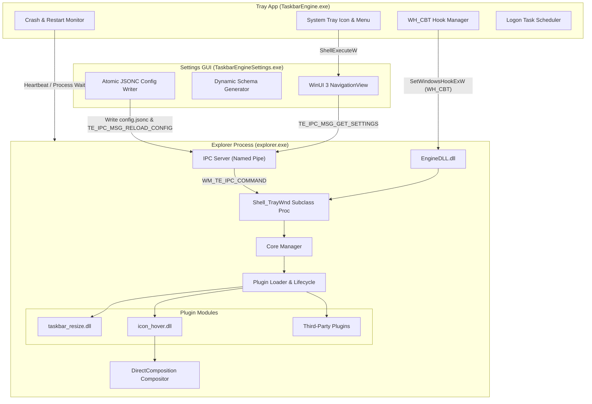

# 01 — System Architecture

> **Source of Truth**: `docs/design_decisions.md`  
> **Component**: TaskbarEngine Core & Subsystems

---

## 1. Architectural Philosophy & Process Model

TaskbarEngine adopts a **Two-Process Model** designed to combine native-speed rendering with crash containment and low resource utilization:

1. **In-Process Engine (`EngineDLL.dll`)**: Injected directly into `explorer.exe`. Hosts the Core Manager, manages the plugin lifecycle, installs `SetWindowSubclass` on `Shell_TrayWnd`, listens to raw Win32 messages, and commits DirectComposition visual trees directly to the taskbar visual compositor.
2. **Out-of-Process Tray Host (`TaskbarEngine.exe`)**: A lightweight Win32 helper process residing in the system notification tray. Installs the injection hook, monitors Explorer health, launches the settings UI, manages scheduled logon tasks, and initiates clean shutdowns.
3. **On-Demand Settings GUI (`TaskbarEngineSettings.exe`)**: A WinUI 3 standalone executable dynamically auto-generated from plugin metadata that communicates with the Engine via Named Pipe IPC and writes directly to `%LOCALAPPDATA%\TaskbarEngine\config.jsonc`.

---

## 2. Injection & Lifecycle Architecture

### A. Targeted `WH_CBT` Hook Injection
- The Tray App discovers `Shell_TrayWnd` using `FindWindowW(L"Shell_TrayWnd", NULL)`.
- It obtains the thread ID via `GetWindowThreadProcessId` and calls `SetWindowsHookExW(WH_CBT, TE_CbtHookProc, hEngineDll, thread_id)`.
- A wake-up message (`WM_NULL`) is posted to `Shell_TrayWnd` to force message loop processing, activating the hook immediately without global broadcast.
- Once `EngineDLL.dll` attaches (`DLL_PROCESS_ATTACH`), the hook is unhooked.

### B. Deferred Phase B Initialization (Loader Lock Safety)
Calling APIs such as `LoadLibraryW` or `CreateThread` inside `DllMain` is forbidden due to Windows OS loader locks. TaskbarEngine enforces a two-phase initialization:

1. **Phase A (`DllMain` / `TE_CoreManagerInitPhaseA`)**:
   - Validates that the hosting process is `explorer.exe`.
   - Allocates the singleton `TE_CoreState`.
   - Installs `SetWindowSubclass` on `Shell_TrayWnd` using `comctl32.dll`.
   - Posts a custom window message `WM_TE_INIT` to `Shell_TrayWnd` and immediately returns `TRUE`.
2. **Phase B (`TE_CoreManagerInitPhaseB`)**:
   - Intercepted on the main UI thread when `WM_TE_INIT` is processed.
   - Loads initial configuration from `%LOCALAPPDATA%\TaskbarEngine\config.jsonc`.
   - Starts the asynchronous directory change watcher (`ReadDirectoryChangesW`).
   - Scans the `Modules/` directory and loads plugin DLLs.
   - Starts the Named Pipe IPC Server background thread.

---

## 3. Communication Protocols

| Endpoint | Protocol | Transport | Purpose |
|---|---|---|---|
| Tray Host $\leftrightarrow$ Engine | Named Pipe / Windows Messages | `\\.\pipe\TaskbarEngine` & `WM_TE_*` | Heartbeat monitoring, graceful shutdown, hook injection. |
| Settings GUI $\rightarrow$ Engine | Named Pipe IPC | `\\.\pipe\TaskbarEngine` (`TE_IpcHeader`) | Query plugin metadata, schema descriptors, live telemetry, hot-reload notifications. |
| Settings GUI $\rightarrow$ Disk | File I/O (Atomic) | `%LOCALAPPDATA%\TaskbarEngine\config.jsonc` | User settings persistence. |
| Engine $\leftrightarrow$ Plugins | Function Pointer VTable | `PluginInterface` & `PluginContext` | Synchronous event bus, inter-plugin state blackboard, timers, message hooks. |

---

## 4. Threading & Synchronization Architecture

- **UI Main Thread (Message Pump)**: All state changes, plugin invocations (`Enable`, `Disable`, `Update`), window message hooks, and DirectComposition commits execute strictly on Explorer's UI thread.
- **IPC Server Thread**: Dedicated background thread accepting named pipe connections. All mutating actions are marshaled to the UI thread via `SendMessageTimeoutW(taskbar_hwnd, WM_TE_IPC_COMMAND, ...)` with `SMTO_ABORTIFHUNG | SMTO_BLOCK` (2000 ms timeout).
- **Directory Change Watcher Thread**: Waits on `ReadDirectoryChangesW` and marshals config reload events to the UI thread.
- **Log Flush Thread**: Flushes lock-free SRWLock-guarded ring buffer log entries to disk asynchronously.

---

## 5. Fault Isolation & Crash Containment

Every call into plugin code (`Initialize`, `Enable`, `Disable`, `Update`, `OnEvent`, message callbacks) is wrapped in Structured Exception Handling (`__try` / `__except`):

- **Catch Filter**: `TE_FaultFilter(GetExceptionInformation(), plugin_name)`.
- **Action on Fault**:
  1. Captures exception code, instruction address, and registers.
  2. Emits an emergency log record to `TaskbarEngine.log`.
  3. Increments plugin crash counter. If threshold (>3 in 60s) is exceeded, the plugin is permanently disabled for the session.
  4. Restores taskbar visual geometry to native state.
  5. Continues Explorer message pump without process termination.
