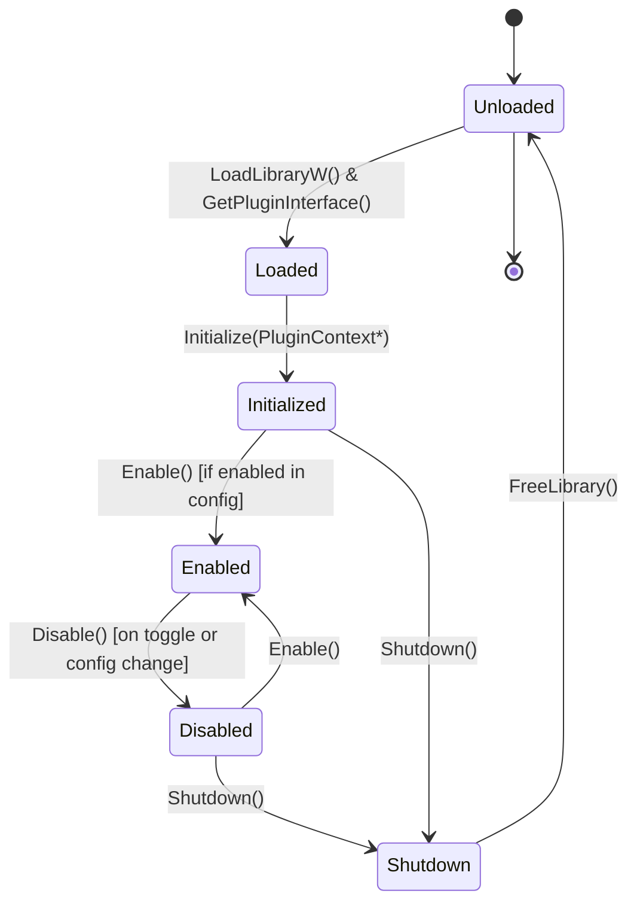

# 04 — Plugin System

> **Source of Truth**: `docs/design_decisions.md`  
> **Component**: Plugin Architecture & ABI (`SDK/include/sdk/te_plugin.h`)

---

## 1. Design Principles & Pure C ABI

TaskbarEngine enforces a **Pure C17 Plugin ABI**:
- **No COM interfaces or C++ classes** at the boundary to ensure zero compiler-mangling incompatibilities.
- Every plugin DLL exports exactly one C function:
  ```c
  TE_EXPORT const PluginInterface* GetPluginInterface(void);
  ```
- **Frozen Layout**: `PluginInterface` and v1 `PluginContext` layouts are immutable.
- **ABI Evolution**: New features are appended to `PluginContext` with version gating via `struct_size` and `api_version`.



---

## 2. Plugin VTable (`PluginInterface`)

```c
typedef struct PluginInterface {
    HRESULT (*Initialize)(const PluginContext* ctx);
    HRESULT (*Enable)(void);
    HRESULT (*Disable)(void);
    HRESULT (*Update)(float deltaTime);
    HRESULT (*Shutdown)(void);
    const PluginMetadata* (*GetMetadata)(void);
    const PluginSettings* (*GetSettings)(void);
} PluginInterface;
```

### Method Contracts
- **`Initialize(ctx)`**: Called once upon DLL discovery. Plugin stores the `PluginContext` pointer, reads initial config, and allocates heap memory / DirectX resources. Must complete in < 5 ms.
- **`Enable()`**: Activates visual hooks, subscribes to events/messages, attaches DComp visual trees. Must complete in < 1 ms.
- **`Disable()`**: **Hard Contract** — Must completely revert all taskbar modifications, restore native geometry, unhook messages, and remove visual overlays.
- **`Update(deltaTime)`**: Periodic tick for animations (only invoked when visual frame loops are active).
- **`Shutdown()`**: Releases all remaining allocations and COM resources. Zero leaks allowed.
- **`GetMetadata()`**: Returns static name, author, version, execution priority, and OS build range.
- **`GetSettings()`**: Returns static array of setting descriptors for GUI auto-generation.

---

## 3. Plugin Context (`PluginContext`)

The `PluginContext` struct is passed from the Engine to each plugin during `Initialize()`:

```c
typedef struct PluginContext {
    /* ABI Envelope */
    uint32_t struct_size;                           /* sizeof(PluginContext) */
    uint32_t api_version;                           /* TE_API_VERSION (e.g. 2) */

    /* v1 Fields (Frozen) */
    HWND taskbar_hwnd;                              /* Primary Shell_TrayWnd handle */
    HMONITOR monitor;                               /* Associated monitor handle */
    uint32_t dpi;                                   /* Display DPI scaling */
    const cJSON* config;                            /* Read-only JSON sub-tree for this plugin */
    LogFunc log;                                    /* Thread-safe logger */
    SubscribeFunc subscribe;                        /* Subscribe to Engine events */
    UnsubscribeFunc unsubscribe;                    /* Unsubscribe from Engine events */
    RequestRedrawFunc request_redraw;               /* Request taskbar frame commit */
    PublishStateFunc publish_state;                 /* Publish to inter-plugin blackboard */
    QueryStateFunc query_state;                     /* Query inter-plugin blackboard */
    void* core_opaque;                              /* Core internal handle */

    /* v2 Fields (Appended) */
    SubscribeToMessageFunc subscribe_message;       /* Subclass raw window message hook */
    UnsubscribeFromMessageFunc unsubscribe_message; /* Unhook raw window message */
    RegisterTimerFunc register_timer;               /* UI thread timer registration */
    CancelTimerFunc cancel_timer;                   /* Timer cancellation */
} PluginContext;
```

---

## 4. Setting Descriptors & Schema Generation

Plugins expose user-configurable settings by returning a `PluginSettings` pointer from `GetSettings()`:

```c
typedef enum SettingType {
    TE_SETTING_BOOL,        /* Renders as ToggleSwitch */
    TE_SETTING_INT,         /* Renders as NumberBox */
    TE_SETTING_FLOAT,       /* Renders as Slider */
    TE_SETTING_STRING,      /* Renders as TextBox */
    TE_SETTING_ENUM,        /* Renders as ComboBox */
    TE_SETTING_COLOR        /* Renders as ColorPicker */
} SettingType;
```

---

## 5. Execution Priority & Fault Containment

### Priority Ordering
Plugins declare execution priority via `PluginMetadata.priority`:
- Lower numbers execute first (e.g. `taskbar_resize` = 10; `icon_hover` = 100).
- `Enable()` is executed in **ascending** order of priority.
- `Disable()` is executed in **descending** (reverse) order of priority.

### SEH Fault Isolation
Every invocation across the plugin boundary is wrapped in Structured Exception Handling (`__try` / `__except`). If a plugin crashes:
1. `TE_FaultFilter()` logs the exception address and module name.
2. The fault counter increments. If a plugin faults > 3 times in 60 seconds, it is quarantined and disabled.
3. Native taskbar geometry is restored, preventing Explorer from crashing.
