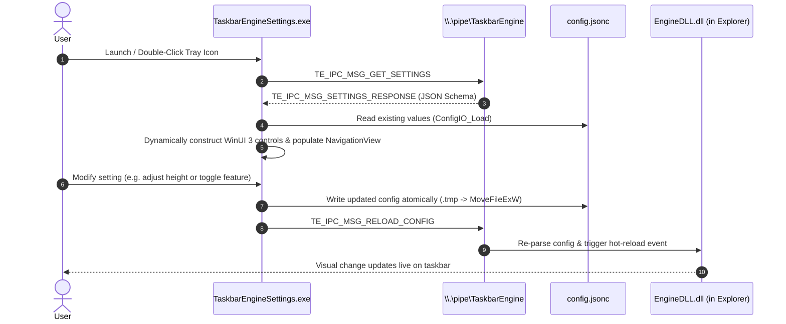

# 06 — Settings GUI

> **Source of Truth**: `docs/design_decisions.md`  
> **Component**: `App/` (`TaskbarEngineSettings.exe`)

---

## 1. Overview & Architectural Role

The **TaskbarEngine Settings GUI** is a modern WinUI 3 application implemented in C++/WinRT. It is structured to be completely decoupled from Explorer:

- **Zero Windows Modifications**: The GUI never modifies taskbar geometry or calls shell APIs directly.
- **Dynamic Auto-Generation**: UI controls are generated on-the-fly at runtime by parsing setting descriptors provided by plugins via Named Pipe IPC.
- **Self-Contained Deployment**: Runs as an unpackaged standalone executable using side-by-side (SxS) activation manifests (`settings_merged.manifest`) without requiring MSIX installation or package registration.

---

## 2. Dynamic Type-to-Control Mapping

When the GUI receives the plugin schema array from the engine, `settings_page.cpp` translates each descriptor type to a native WinUI 3 control:

| Descriptor Type | WinUI 3 Control | Configuration Bound | Visual Interaction |
|---|---|---|---|
| `TE_SETTING_BOOL` | `ToggleSwitch` | `true` / `false` | On/Off toggle switch with immediate event binding |
| `TE_SETTING_INT` | `NumberBox` | Integer values | Number input with inline spin buttons and `Minimum` / `Maximum` bounds |
| `TE_SETTING_FLOAT` | `NumberBox` / `Slider` | Double values | Precision slider or numerical box with step increments |
| `TE_SETTING_STRING` | `TextBox` | UTF-8 String | Text field committing on `LostFocus` |
| `TE_SETTING_ENUM` | `ComboBox` | String option | Dropdown populated with allowed string options |
| `TE_SETTING_COLOR` | `ColorPicker` | ARGB integer | Full spectrum color picker with hex and alpha inputs |

---

## 3. Navigation & Layout Architecture

- **Main Window**: Hosts a `NavigationView` with `Left` pane display mode.
- **Dynamic Tabs**: Each loaded plugin reported by the Engine gets an item in the navigation menu with a settings icon.
- **About Page (`about_page.cpp`)**:
  - Displays product version and build timestamp (`__DATE__`, `__TIME__`).
  - Queries live DirectComposition performance statistics via `GuiIpcGetPerfStats()`.
  - Displays real-time measured FPS, average, minimum, and maximum frame commit times.

---

## 4. Atomic Configuration Persistence (`config_io.cpp`)

When a user modifies any control in the UI:
1. `ConfigIO_Load` reads the existing `%LOCALAPPDATA%\TaskbarEngine\config.jsonc`.
2. `ConfigIO_SetPluginValue` updates the specific key under `"plugin" -> "<plugin_name>"`.
3. `ConfigIO_Save` writes the formatted JSON to a temporary file (`config.jsonc.tmp.<pid>`) with `std::ios::trunc`.
4. `MoveFileExW` replaces the target file atomically with `MOVEFILE_REPLACE_EXISTING | MOVEFILE_WRITE_THROUGH`.
5. `GuiIpcReloadConfig()` sends `TE_IPC_MSG_RELOAD_CONFIG` over the named pipe, triggering instant in-memory hot-reloading in Explorer.
