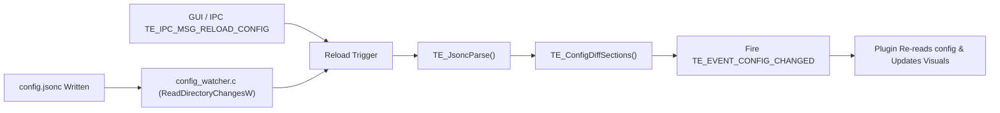

# 07 — Configuration Subsystem

> **Source of Truth**: `docs/design_decisions.md`  
> **Component**: `SDK/` (`te_jsonc.c`), `Core/` (`config.c`, `config_watcher.c`)

---

## 1. Format & Storage Policy

TaskbarEngine uses **JSONC (JSON with Comments)** for all user-facing configuration:

- **Storage Location**: `%LOCALAPPDATA%\TaskbarEngine\config.jsonc`
- **Fallback**: Local working directory `config.jsonc` if LocalAppData is inaccessible.
- **Parsing**: Vendored ANSI C `cJSON` paired with an in-memory comment-stripping preprocessor (`TE_JsoncParse`).
- **Comments**: End users and developers can document their configuration using standard `//` and `/* */` syntax.

```jsonc
{
  "version": 1,

  // Core engine settings
  "core": {
    "log_level": "info",
    "log_to_file": true
  },

  // Per-plugin configuration sections
  "plugin": {
    "taskbar_resize": {
      "enabled": true,
      "height": 48,
      "padding": 4,
      "margins": 0,
      "icon_spacing": 8
    },
    "icon_hover": {
      "enabled": true,
      "scale": 1.35,
      "radius": 130,
      "curve": "gaussian",
      "speed_ms": 150
    }
  }
}
```

---

## 2. Configuration Access & Thread Safety

Inside `EngineDLL.dll`, the active configuration is held in `TE_CoreState.config_root` and protected by a `SRWLOCK`:

```c
/* Plugin-safe configuration access */
HRESULT TE_ConfigLoad(const wchar_t* path, cJSON** out_root);
const cJSON* TE_ConfigGetPluginSection(const cJSON* root, const char* plugin_name);
int   TE_ConfigGetInt(const cJSON* section, const char* key, int default_val);
float TE_ConfigGetFloat(const cJSON* section, const char* key, float default_val);
bool  TE_ConfigGetBool(const cJSON* section, const char* key, bool default_val);
const char* TE_ConfigGetString(const cJSON* section, const char* key, const char* default_val);
```

- Plugins receive a read-only pointer to their specific sub-tree via `PluginContext.config`.
- Multi-reader single-writer synchronization ensures plugin reads are wait-free during rendering.

---

## 3. Hot-Reloading & Change Detection

TaskbarEngine supports **zero-restart live configuration reload**:



### Diff-Based Event Dispatch
When a reload is triggered:
1. The new JSON tree is parsed and validated in temporary memory. If malformed, the error is logged and the existing valid configuration remains active.
2. The Core Manager diffs the new tree against the old tree on a per-plugin basis.
3. If `"enabled"` transitions:
   - `false` $\rightarrow$ `true`: The plugin's `Enable()` method is called.
   - `true` $\rightarrow$ `false`: The plugin's `Disable()` method is called.
4. For enabled plugins whose parameters changed, `TE_EVENT_CONFIG_CHANGED` is dispatched synchronously on Explorer's UI thread.
