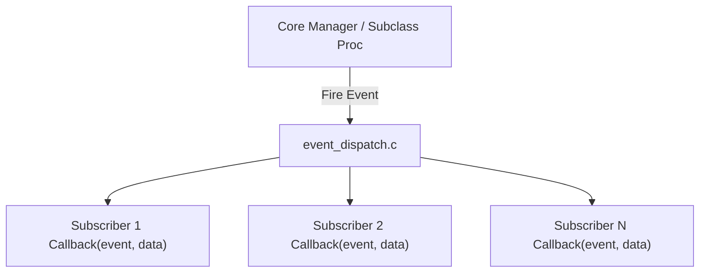

# 08 — Event System & Inter-Plugin State

> **Source of Truth**: `docs/design_decisions.md`  
> **Component**: `SDK/include/sdk/te_events.h`, `Core/src/event_dispatch.c`, `Core/src/state_store.c`

---

## 1. Synchronous In-Process Event Bus

TaskbarEngine uses a **direct function-pointer callback bus** for event distribution inside Explorer. There is zero dynamic heap allocation during event dispatch:

- **Zero-Latency Dispatch**: Direct synchronous execution; latency is < 1 µs per dispatch.
- **Thread Affinity**: All event callbacks execute strictly on Explorer's main UI thread.
- **Fault Isolation**: Callback executions are protected by SEH (`__try` / `__except`).



---

## 2. Event Types & Payloads (`te_events.h`)

| Event Type | ID | Payload Structure | Description |
|---|---|---|---|
| `TE_EVENT_CONFIG_CHANGED` | 0 | `TE_EventConfigChanged` | Dispatched when a plugin's configuration values are modified. Contains plugin name pointer. |
| `TE_EVENT_TASKBAR_CREATED` | 1 | `TE_EventTaskbarCreated` | Sent when `TaskbarCreated` is broadcast by Explorer after shell recreation. |
| `TE_EVENT_DISPLAY_CHANGED` | 2 | `TE_EventDisplayChanged` | Fired on `WM_DISPLAYCHANGE` when monitor resolution or bounds change. |
| `TE_EVENT_DPI_CHANGED` | 3 | `TE_EventDpiChanged` | Fired on `WM_DPICHANGED` with new DPI scaling factor and recommended window rect. |
| `TE_EVENT_THEME_CHANGED` | 4 | `TE_EventThemeChanged` | Fired on `WM_THEMECHANGED` (Light / Dark mode or Accent color changes). |
| `TE_EVENT_EXPLORER_RESTARTED`| 5 | `NULL` | Broadcast when the shell recovers from an Explorer crash. |
| `TE_EVENT_PLUGIN_ENABLED` | 6 | `const char*` | Dispatched when another plugin is enabled. |
| `TE_EVENT_PLUGIN_DISABLED`| 7 | `const char*` | Dispatched when another plugin is disabled. |

---

## 3. Raw Win32 Window Message Filtering (`te_msg_filter.c`)

Plugins requiring direct window message interception on `Shell_TrayWnd` (e.g. `WM_MOUSEMOVE` for mouse tracking in `icon_hover`) register message subscriptions via `PluginContext.subscribe_message`:

```c
/* Plugin registers interest in WM_MOUSEMOVE */
ctx->subscribe_message(WM_MOUSEMOVE);
```

- When the message passes through `TE_TaskbarSubclassProc`, the message filter table checks for active subscriptions and dispatches directly to the registering plugin.

---

## 4. Inter-Plugin State Blackboard (`state_store.c`)

Plugins can publish and query shared state without direct compile-time coupling:

```c
/* Supported shared data types */
typedef enum StateValueType {
    TE_STATE_TYPE_INT,
    TE_STATE_TYPE_FLOAT,
    TE_STATE_TYPE_BOOL,
    TE_STATE_TYPE_RECT
} StateValueType;
```

### Typical Use Case
1. **`taskbar_resize`** publishes the modified taskbar height:
   ```c
   StateValue val = { .type = TE_STATE_TYPE_INT, .value = { .i = new_height } };
   ctx->publish_state("taskbar.height", &val);
   ```
2. **`icon_hover`** queries `"taskbar.height"` to dynamically compute vertical centering offsets for its DirectComposition visuals.
