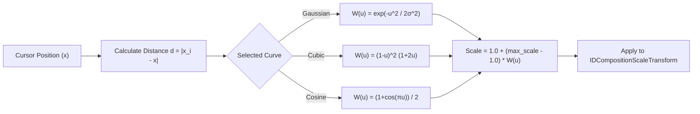

# 11 — IconHover Magnification Engine

> **Source of Truth**: `docs/design_decisions.md`  
> **Component**: `Modules/icon_hover/` (`icon_hover.dll`)

---

## 1. Overview & Visual Objective

The **`icon_hover`** plugin brings smooth, macOS Dock-style continuous magnification waves to the Windows 11 Taskbar. When the cursor moves over taskbar icons, the hovered icon expands smoothly while neighboring icons scale proportionally according to a configurable mathematical bell curve.

```
Modules/icon_hover/
├── CMakeLists.txt
├── icon_hover.c            # Plugin lifecycle and event orchestration
├── magnification.c / .h    # Mathematical magnification wave algorithms
├── icon_layout.c / .h      # Icon coordinate mapping and layout cache
├── uia_discovery.cpp / .h  # UI Automation taskbar button discoverer
├── icon_capture.cpp / .h   # Direct2D/WIC surface capture
├── dcomp_overlay.cpp / .h  # DirectComposition visual tree manager
└── frame_loop.cpp / .h     # High-precision animation frame loop
```

---

## 2. Mathematical Magnification Wave (`magnification.c`)

For any icon with center position \(x_i\) and cursor position \(x_{cursor}\), the distance is:
\[
d = |x_i - x_{cursor}|
\]

If \(d \ge \text{radius}\), the icon scale is \(1.0\) (unmodified). If \(d < \text{radius}\), the scale is computed as:
\[
S(d) = 1.0 + (\text{max\_scale} - 1.0) \times W\left(\frac{d}{\text{radius}}\right)
\]

### Supported Easing Curves (\(W(u)\), where \(u = d / \text{radius} \in [0, 1]\))

1. **Gaussian Bell Curve (Default)**:
   \[
   W(u) = \exp\left(-\frac{u^2}{2\sigma^2}\right) \quad (\sigma = 0.4)
   \]
2. **Cubic Smoothstep**:
   \[
   W(u) = (1 - u)^2(1 + 2u)
   \]
3. **Cosine Wave**:
   \[
   W(u) = \frac{1 + \cos(\pi u)}{2}
   \]
4. **Linear Falloff**:
   \[
   W(u) = 1 - u
   \]



---

## 3. Configuration & Setting Descriptors

| Key | Label | Type | Default | Range / Options | Description |
|---|---|---|---|---|---|
| `scale` | Max Hover Scale | `float` | `1.35` | `1.0` to `2.0` (step `0.05`) | Peak magnification multiplier for the hovered icon. |
| `radius` | Effect Radius | `int` | `130` | `40` to `300` px (step `10`) | Horizontal influence spread over neighbor icons. |
| `curve` | Easing Curve | `enum` | `"gaussian"` | `["gaussian", "cubic", "linear", "cosine"]` | Falloff mathematical curve type. |
| `speed_ms` | Animation Duration| `int` | `150` | `50` to `500` ms (step `10`) | Settle animation duration when mouse departs. |

---

## 4. Performance & Frame Scheduling

- **DirectComposition Transforms**: Individual icon surfaces remain stationary in GPU memory; only their `IDCompositionScaleTransform` and `IDCompositionTranslateTransform` matrices are updated per frame.
- **Render Budget**: Transform recalculation takes < 0.05 ms for 30 taskbar icons.
- **Latency**: Sub-millisecond pipeline from `WM_MOUSEMOVE` to GPU compositor `Commit()`.
