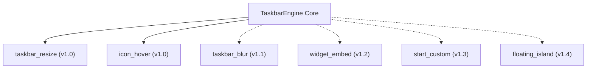

# 18 — Future Features & Roadmap

> **Source of Truth**: `docs/design_decisions.md`  
> **Component**: Architectural Roadmap & Planned Modules

---

## 1. Post-v1 Plugin Concepts

The modular architecture of TaskbarEngine allows adding new capabilities as isolated DLL plugins without modifying the Core Manager:

### Planned Modules
1. **`taskbar_blur` (v1.1)**:
   - Injects custom Acrylic and Mica backdrop materials directly behind `Shell_TrayWnd` using DWM composition attributes.
2. **`widget_embed` (v1.2)**:
   - Compact real-time hardware telemetry widgets (CPU%, GPU%, Network throughput, RAM) embedded between taskbar items and the notification tray.
3. **`start_custom` (v1.3)**:
   - Custom animated SVG/Lottie Start button icons with interactive hover and click effects.
4. **`floating_island` (v1.4)**:
   - Separates the taskbar into independent floating segmented islands (Start island, App island, Tray island).

---

## 2. Platform & OS Evolution

### A. Windows 12 Compatibility Strategy
- TaskbarEngine relies on documented Win32 subclassing and DirectComposition rather than hardcoded memory offsets or binary patching.
- When new Windows preview builds modify taskbar XAML element trees, updates are isolated to UI Automation discoverers without breaking the core ABI.

### B. Rust Plugin Evaluation Gate
- Per project rules, Rust is permitted for plugin authoring only if empirical benchmarks demonstrate a **> 5% improvement** in memory, CPU, or latency over C17/C++17.
