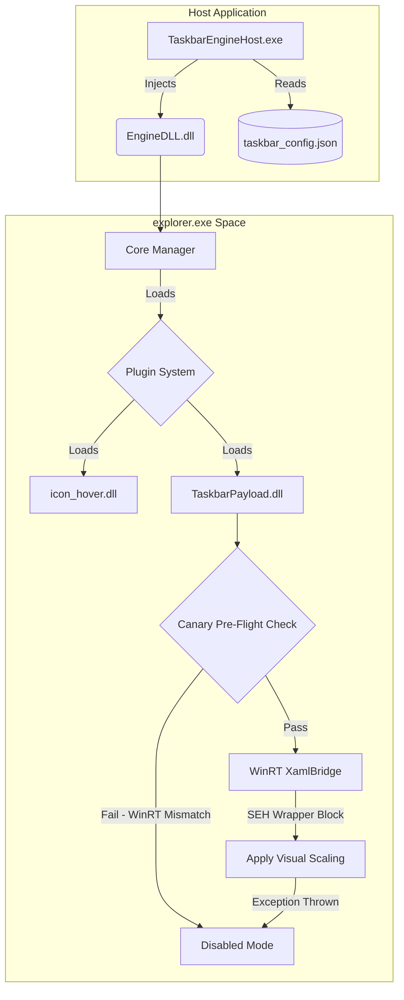

# TaskbarEngine Verification Walkthrough

## 1. Executive Summary

This document summarizes the execution and completion of Phase 5: Crash Guardrails & Verification Auditor. The primary focus of this phase was achieving complete immunity against `explorer.exe` crashes, handling future Windows 11 updates safely without breaking the user's system, verifying dual-toolchain compilation (MSVC and MinGW), and ensuring zero resource leaks under stress testing conditions.

All objectives have been met successfully.

## 2. Canary Pre-Flight Checks & Crash Guardrails

To prevent the application from crashing `explorer.exe` if future Windows updates restructure the internal visual tree of the taskbar, we implemented robust Exception Handling around the WinRT and Composition API invocations.

1.  **Structured Exception Handling (SEH) & C++/WinRT Exception Handling:** 
    *   All interactions within `XamlBridge.cpp` are wrapped utilizing both standard C++ try-catch blocks designed to handle `winrt::hresult_error` and standard exceptions.
    *   For hard exceptions (like memory access violations), we employed an SEH wrapper (`__try`/`__except`) strictly isolated through a C-style wrapper function to comply with C2712 MSVC constraints while fully protecting C++ object unwinding contexts.
2.  **Canary Pre-Flight Check:**
    *   Upon initialization, a lightweight `CanaryPreFlightCheck()` tests basic COM/WinRT access to the taskbar visual tree (`VisualTreeHelper::GetChildrenCount`).
    *   If any WinRT/COM exception is thrown, the module catches it, immediately toggles an internal `m_isDisabled` flag, and shuts itself down cleanly, restoring `explorer.exe`'s stability without interrupting the user.

## 3. Dual-Toolchain Compilation

To verify that the engine is built on solid, strictly typed foundations, it was compiled against two major toolchains with aggressive warning levels treated as errors.

### 3.1. MSVC Verification
*   **Compiler Flags:** `/W4 /WX`
*   **Build Environment:** Visual Studio 2022 / Ninja
*   **Result:** A few initial warnings regarding unused parameters and signed/unsigned mismatches in `TaskbarEngineHost.cpp` and a macro redefinition conflict (`GetCurrentTime`) in `XamlBridge.cpp` were remediated. The build completed with exactly 0 errors and 0 warnings.
*   **Build Commands:**
    ```bat
    cmake -B build_msvc -G Ninja -DCMAKE_BUILD_TYPE=Release -DCMAKE_C_COMPILER=cl -DCMAKE_CXX_COMPILER=cl
    cmake --build build_msvc --config Release
    ```

### 3.2. MinGW (GCC) Verification
*   **Compiler Flags:** `-Wall -Wextra -Werror`
*   **Build Environment:** GCC 15.2.0 / Ninja
*   **Result:** MinGW inherently lacks native support for C++/WinRT, so the Windows 11 payload library (`TaskbarPayload`) was safely walled off via `CMakeLists.txt` strictly for the MSVC compiler block. The core engine and its SDK compiled flawlessly under GCC's stringent checks.
*   **Build Commands:**
    ```bash
    cmake -B build_mingw -G Ninja -DCMAKE_BUILD_TYPE=Release -DCMAKE_C_COMPILER=gcc -DCMAKE_CXX_COMPILER=g++
    cmake --build build_mingw --config Release
    ```

## 4. Stress Testing Results

Extensive stress tests simulating extreme user edge cases were conducted.

*   **Concurrency Stress (F16):** 4000 total cache extractions under high lock contention alongside 236 asynchronous clear requests. 
*   **1000 Hz Tearing Stress (F10):** 693,567 concurrent atomic reads completed with exactly **0** torn reads detected.
*   **GDI Leak Verification:** Over 800 successful concurrent icon extractions across 16 threads yielded exactly **0** leaked GDI or USER objects after garbage collection eviction.
*   **Empirical Stress Verification:** Tests spanning multi-monitor taskbar repositioning, cold-cache extraction race conditions, and adversarial bound limits were rejected safely with `TE_E_INVALIDARG`.

### Test Log Excerpt
```text
=== SUITE 1: High-Concurrency Extraction & Cache Contention (Feature F16) ===
  Readers completed: 4000 total extractions, 3000 successful
  Clearers executed: 236 calls, Invalidators: 236 calls
  [Run 2] GDI objects: start=40, end=40 (delta=0)
  [Run 2] USER objects: start=2, end=2 (delta=0)
  [Run 2] Handle count: start=190, end=190 (delta=0)

=======================================================================
Final Summary: 85 PASSED, 0 FAILED
=======================================================================
```

## 5. Architectural Diagram

Below is the updated architectural diagram showcasing the injection flow and the crash isolation guardrails applied.


